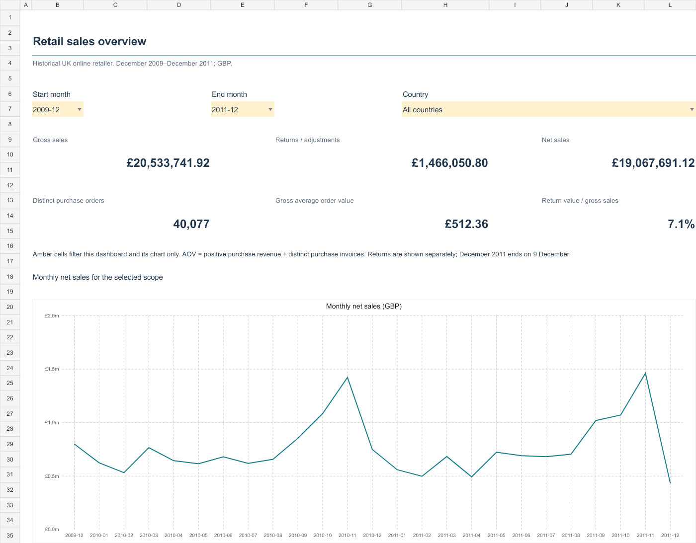

# Retail Customer Intelligence and Sales Analytics

An Excel analytics portfolio project by **Waqas Khan**, a Data Science student at the University of Malakand.

This project turns 1,067,371 historical invoice lines into a sales dashboard, customer RFM segments, monthly retention cohorts, product contribution analysis and country comparisons. The business question is: **where does revenue come from, how often do customers return, and which patterns deserve further investigation?**

[Open the workbook](Retail_Customer_Intelligence.xlsx) · [Methodology](docs/METHODOLOGY.md) · [Data provenance](docs/DATA_PROVENANCE.md) · [Data dictionary](docs/DATA_DICTIONARY.md) · [Validation](docs/VALIDATION.md)



## Five calculated findings

| Finding | Evidence | Business implication |
| --- | --- | --- |
| Returns materially affect sales | Gross sales **£20,533,741.918**; returns/adjustments **£1,466,050.800**; net sales **£19,067,691.118**. Return value is **7.14%** of gross sales. | Investigate high-value cancellation invoices and return reasons before setting reduction targets. |
| Many identified customers bought again | **4,255 of 5,878** identified positive purchasers made at least two purchase invoices: **72.4%**. | Test retention campaigns with a holdout group; this is historical repeat purchasing, not a prediction. |
| Sales concentrate in a minority of stock codes | **1,010 of 4,916** positive-sales codes, or **20.5%**, account for at least 80% of gross sales. | Prioritize availability analysis for leading codes after distinguishing merchandise from service charges. |
| The UK dominates net sales | The United Kingdom contributes **84.9%** of net sales. | Compare international markets separately; sales figures do not establish profitability. |
| Matched-period growth is modest | Jan–Nov net sales increased from **£8,497,953.954** in 2010 to **£8,587,247.024** in 2011: **1.05%**. | Use complete matching months; December 2011 ends on the ninth and is not a full-month comparison. |

Amounts preserve source precision. Excel displays GBP to two decimal places. No cost or margin data exists, so no profit claims are made.

## Dataset and attribution

**Chen, D. (2012). Online Retail II [Dataset]. UCI Machine Learning Repository. [DOI: 10.24432/C5CG6D](https://doi.org/10.24432/C5CG6D).**

- Publisher: [UCI Machine Learning Repository](https://archive.ics.uci.edu/dataset/502/online+retail+ii).
- Source: an unnamed UK non-store retailer selling giftware, including wholesale customers.
- Observed period: **1 December 2009–9 December 2011**. These are historical records, not current retail performance.
- License: [Creative Commons Attribution 4.0](https://creativecommons.org/licenses/by/4.0/). Derived tables retain this attribution and license. Code is separately licensed under [MIT](LICENSE).
- Download date: **25 September 2026**. Original file hashes and download instructions appear in [provenance](docs/DATA_PROVENANCE.md).
- The original workbook exceeds a single worksheet's row limit. Every row is processed outside the Excel grid; no rows are silently truncated. The raw file is excluded from GitHub to keep the repository small.

## Workbook guide

| Worksheet | Purpose and interaction |
| --- | --- |
| `Start_Here` | Navigation, refresh instructions and compatibility notes. |
| `Sales_Overview` | Date and country dropdowns update gross sales, returns, net sales, orders, AOV, return ratio and the monthly chart. |
| `Product_Analysis` | Top-code chart and full code-level ranking with Pareto shares. The detail table begins on row 33. |
| `Customer_RFM` | Segment summary/chart, segment selector, repeat purchase rate and all 5,878 customer records. Detail starts at row 38; filter by country or segment. |
| `Cohort_Retention` | Formula-driven retention rates and underlying distinct customer counts. Blanks denote unobserved future periods. |
| `Regional_Analysis` | Country totals and an international-market chart; the UK remains in all totals. |
| `Insights` | Five findings, implications and interpretive limits. |
| `Data_Quality` | Missing values, repeated lines, returns, exclusions and reconciliation differences. |
| `Data_Dictionary` | Fields, metric definitions, source citation and table grains. |
| `Monthly_Data` | One row per country-month, plus independent source control totals and dropdown lists. |

### Beginner walkthrough

1. Open `Retail_Customer_Intelligence.xlsx` in desktop Excel. It has no macros and needs no web server.
2. Start at `Sales_Overview`. Leave **2009-12**, **2011-12**, and **All countries** selected to see the complete scope.
3. Change the country to **United Kingdom** and dates to **2011-01** through **2011-11**. The KPIs and chart use the same filters. Restore the full scope afterward.
4. Open `Customer_RFM` and choose **At risk**. The segment count and gross spend update. To inspect individual customers, type `B38` into Excel's Name Box, then use the table's country/segment filter arrows.
5. Read `Cohort_Retention` across a row: M0 is the observed first purchase month; M1 is the next month. Each percentage uses the original cohort size as its denominator. The amber underline identifies the partial final month.
6. Open `Data_Quality`. Reconciliation differences should be zero within a £0.000001 numerical tolerance. Read the repeated-row sensitivity before presenting totals.

Filtering a detail table does **not** recalculate other sheets or summary cards. The amber dashboard controls have the explicitly described scope. Table dropdowns are ordinary Excel filters, not slicers.

## Methods and quality decisions

Gross sales use positive quantities and prices on non-cancelled invoices. Returns use the absolute line value when quantity is negative or the invoice begins with `C`, with positive price required. Net sales subtract returns from gross. Gross AOV is gross sales divided by **40,077** distinct purchase invoices.

After resolving cross-sheet overlap, missing customer IDs affect **235,287** analysis rows. Valid monetary lines still contribute to sales; those rows do not enter RFM, cohorts or identified-customer counts. **6,024** zero-price lines and **5** negative-price lines are excluded from monetary analysis.

The source sheets overlap on 1–9 December 2010. Matching all eight original fields **and each line's within-sheet occurrence number** identifies **22,523** repeated import records. Removing those from the second sheet leaves **1,044,848** analysis rows. The removed records are supplied in an audit CSV. This avoids double importing the same occurrences while preserving repeated lines inside a source sheet.

The remaining **11,812** exact repeated lines after the first occurrence are retained because no transaction-line ID establishes whether they are errors. Removing them would lower net sales by **£54,228.42**. This is a sensitivity calculation, not an approved additional cleaning rule. The correction for cross-sheet overlap reduces the uncorrected net total by **£377,488.45**. All findings above use the corrected population.

RFM uses a fixed reference date of **10 December 2011**, distinct purchase invoices for frequency and gross purchase spend for monetary value. Percentile cut points keep ties together. Cohorts reflect first **observed** purchase, not proven acquisition. Full definitions, segment priority, grains and exclusions are in [methodology](docs/METHODOLOGY.md).

## Tools, refresh and reproducibility

Analysis: Python, pandas, NumPy and openpyxl for **reading** the original XLSX. Workbook authoring: JavaScript and `@oai/artifact-tool`. The delivered workbook uses native Excel tables, formulas, charts, data validation and conditional formatting.

To reproduce the analysis with Python 3.11 or later, open PowerShell in the project folder:

```powershell
py -m pip install -r requirements.txt
py scripts/prepare_data.py --download
```

If the download is interrupted, [download the official ZIP](https://archive.ics.uci.edu/static/public/502/online%2Bretail%2Bii.zip), extract `online_retail_II.xlsx` into `data/raw`, then run:

```powershell
py scripts/prepare_data.py
```

This regenerates the processed CSVs, `analysis.json` and source profile. It deliberately fails on an unexpected row count so a different source must be reviewed rather than silently accepted.

To rebuild the workbook on this laptop using the installed Codex dependency runtime:

```powershell
.\scripts\rebuild.ps1
```

The workbook builder requires the `@oai/artifact-tool` runtime bundled with Codex. It is **not** an ordinary public npm dependency to install from this repository. The PowerShell script locates the installed runtime, creates a local dependency junction if needed, prepares the data and builds the workbook. On a machine without that runtime, the analysis scripts still work and the delivered workbook opens independently; ask Codex to rebuild the workbook from the generated analysis file. Close the workbook in Excel before rebuilding.

Excel **Refresh All does not import new source transactions** in this version. Editing prepared inputs updates dependent Excel formulas, but it does not rerun Python's RFM scoring, product sorting, source grouping or cohort membership. Refresh those by rerunning the scripts.

## Validation and limitations

Automated checks reconcile gross/return/net sales, distinct orders and customers, product/country/month aggregates and cohort populations. RFM scores and retention counts are bounded. Dashboard and segment controls were changed and checked against independent Python totals, then restored. All worksheets were rendered for visual review. Exported formulas, tables, charts and dropdown definitions are checked separately; results are in [validation](docs/VALIDATION.md).

Office 2024 64-bit was detected on the laptop. **Native desktop Excel opening, dropdown interaction and rendered chart behavior have not been verified.** Power Query, PivotTables, PivotCharts, slicers and the Data Model are **not implemented**. The available workbook writer could not reliably export PivotTables, so this version uses formula-driven controls and native charts. No claims are made about those absent features.

Customer histories are bounded by the observation window. Country is not delivery geography. Stock codes include non-merchandise entries. Return reasons, costs, margins, marketing exposure and causal treatment effects are unavailable. Forecasting is omitted because no credible holdout evaluation has been established.

## Interview explanation

> I built a retail analytics workbook from over one million UCI transaction records. I defined purchase and return populations before calculating KPIs, kept anonymous sales in revenue while excluding them from customer metrics, and investigated repeated lines without automatically deleting them. I prepared customer RFM segments, first-observed-purchase cohorts, product Pareto analysis and country comparisons. In Excel, I added linked filters, charts and reconciliation checks. One finding was that roughly one fifth of positive-sales codes generated four fifths of gross sales. I also documented limitations, including partial December coverage, missing customer IDs and the absence of profit data.

Skills demonstrated: data preparation, Excel formulas and validation, KPI design, customer segmentation, retention analysis, reproducibility, visual communication and transparent analytical judgment. The Python script and workbook were developed with AI assistance; explain and verify the methods yourself before presenting the project as evidence of your skills.

## Repository contents

```text
Retail_Customer_Intelligence.xlsx
assets/                 actual workbook renders
data/processed/         reusable aggregate and customer tables
data/raw/               local source only, excluded from Git
docs/                   methodology, provenance, dictionary and checks
scripts/                preparation, workbook builder and validation
requirements.txt
LICENSE
```

This is an original portfolio case study informed by the presentation conventions visible on the [Excel projects topic](https://github.com/topics/excel-projects). It does not copy another repository's implementation or findings.
